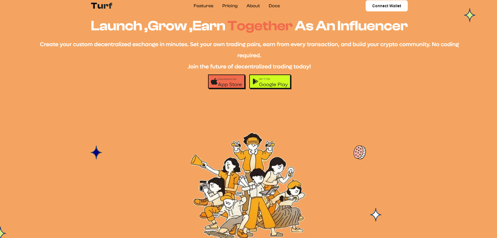
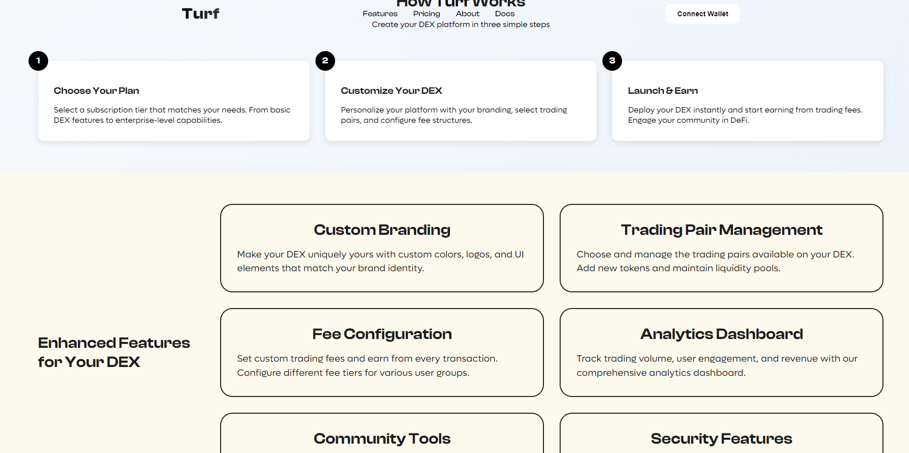
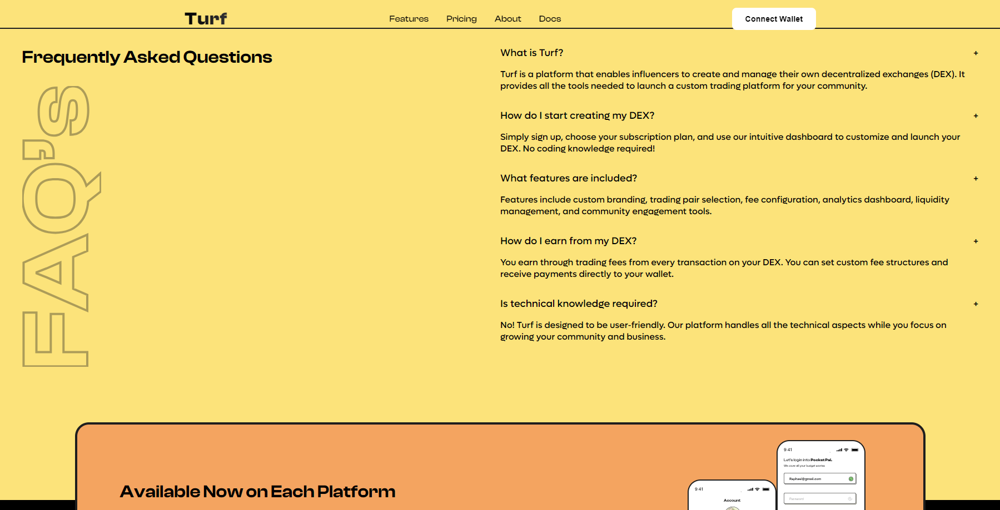
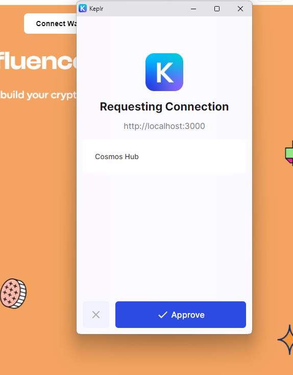
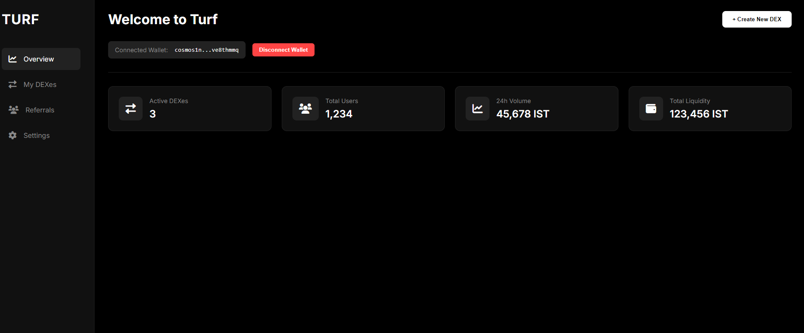
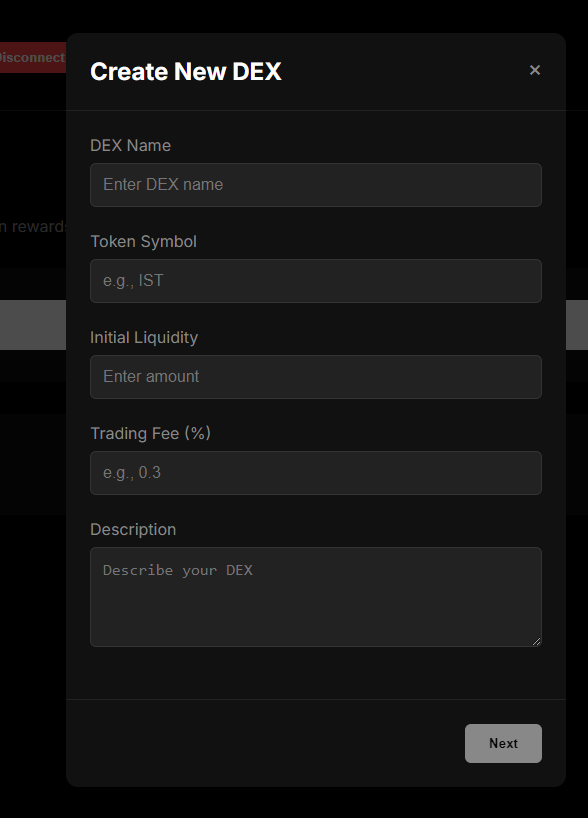
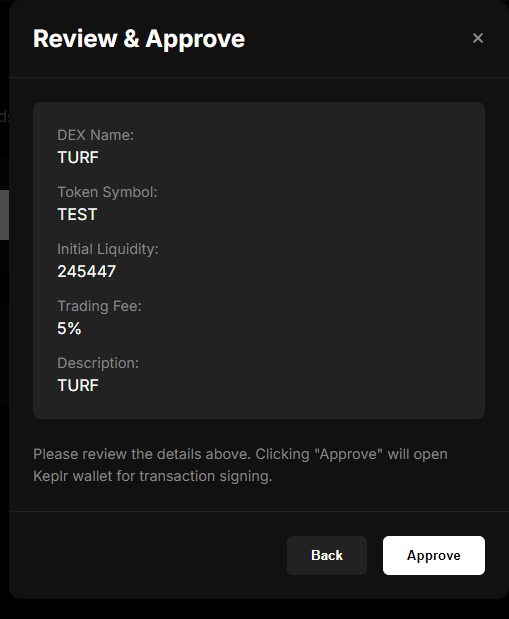
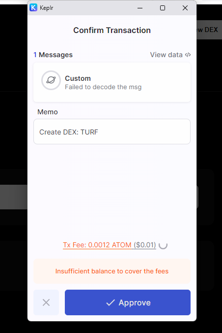
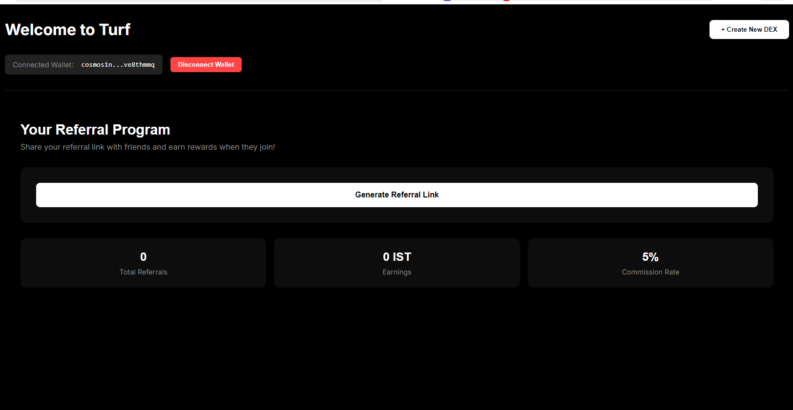

# Turf - Influencer DEX Platform

Turf is an innovative decentralized exchange (DEX) platform specifically designed for influencers to create and manage their own cryptocurrency exchanges. It empowers content creators and influencers to build stronger communities through tokenized engagement.

## Features

- **Custom DEX Creation**: Create your own branded decentralized exchange
- **Analytics Dashboard**: Track performance metrics and user engagement
- **Referral System**: Grow your community through a robust referral program
- **Multi-DEX Management**: Manage multiple exchanges from a single dashboard
- **Real-time Statistics**: Monitor trading volumes, user activity, and revenue

## Technology Stack

- **Frontend**: Next.js, React, TypeScript
- **Styling**: Styled Components, Framer Motion
- **Charts**: Chart.js with react-chartjs-2
- **Development**: ESLint, PostCSS

## Screenshots
###In developed UI will be updated to the modern design i the future scope

Here you can add screenshots of your application:










*Note: Replace these placeholder image paths with your actual screenshot paths*

## Future Scope

We have exciting plans to expand Turf's capabilities:

### Social Media Integration
- Twitter integration for trade announcements and community updates
- Instagram connection for influencer content sharing
- Facebook integration for community building
- Discord/Telegram bot integration for trade alerts

### Platform Enhancements
- Mobile app development
- Advanced trading features
- Multi-chain support
- NFT marketplace integration
- Automated market making (AMM) capabilities

### Community Features
- Token launchpad
- Governance system
- Staking mechanisms
- Yield farming opportunities
- Community rewards program

## Getting Started

First, run the development server:

```bash
npm run dev
# or
yarn dev